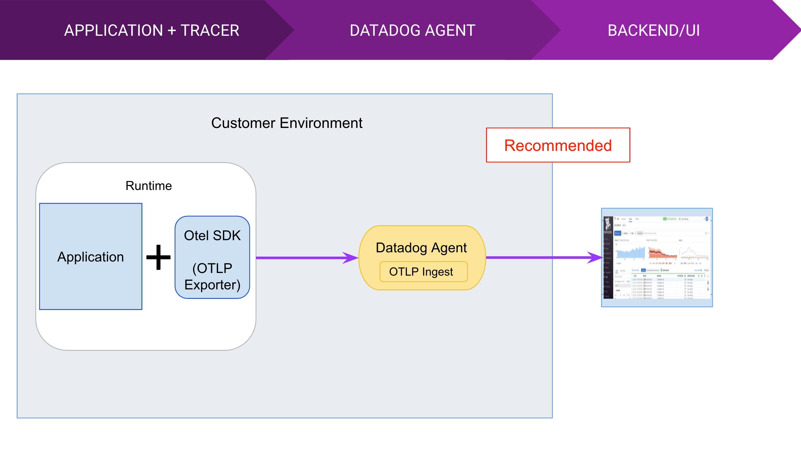

# Elixir + OpenTelemetry + Datadog Example

This is an example Phoenix application that makes use of OpenTelemetry tracing and sends traces to Datadog through a Datadog agent over [OTLP](https://github.com/open-telemetry/opentelemetry-specification/blob/main/specification/protocol/otlp.md).



This is the recommended approach for [sending OpenTelemetry data to Datadog](https://docs.datadoghq.com/tracing/setup_overview/open_standards/otlp_ingest_in_the_agent/?tab=docker).

## Running it

You'll need **Docker**.

First, add your Datadog API key. This example assume you have a file in you home directory called `sandbox.docker.env` that contains:

```
DD_API_KEY=<Datadog API Key>
```

Build the service with 

```
docker-compose build
```

Then run it with

```
docker-compose up -d
```

Visit http://localhost:4000/posts a couple of times for the traces to be sent to Datadog and observe them in Datadog's APM page.

## Moving parts

Here's an outline of the important parts of this example.

### Phoenix app

Most of the source code is that of a Phoenix application with OpenTelemetry configured. In order to do that, we needed the following dependencies:

* [`opentelemetry_api`](https://hex.pm/packages/opentelemetry_api) - instruments our application,
* [`opentelemetry`](https://hex.pm/packages/opentelemetry) - collects traces within our runtime and passes them to the exporter,
* [`opentelemetry_exporter`](https://hex.pm/packages/opentelemetry_exporter) - exports traces using OpenTelemetry Protocol to the OpenTelemetry Collector.

Instrumented code can be seen in the [PostController](https://github.com/codyborders/elixir_opentelemetry_datadog_example/blob/main/lib/otel_example_web/controllers/post_controller.ex#L10)'s `index` function.
